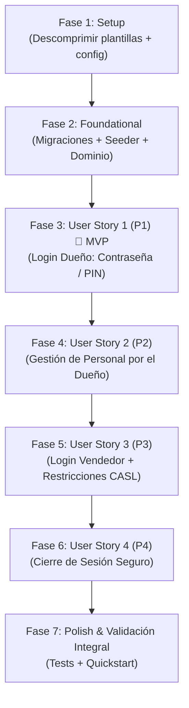

# Tasks: Capítulo 1 — Base Estructural y Acceso al Sistema

**Input**: Design documents from `specs/001-base-estructural-acceso/`  
**Prerequisites**: [plan.md](file:///c:/xampp/htdocs/servimatica-app/specs/001-base-estructural-acceso/plan.md), [spec.md](file:///c:/xampp/htdocs/servimatica-app/specs/001-base-estructural-acceso/spec.md), [research.md](file:///c:/xampp/htdocs/servimatica-app/specs/001-base-estructural-acceso/research.md), [data-model.md](file:///c:/xampp/htdocs/servimatica-app/specs/001-base-estructural-acceso/data-model.md), [contracts/](file:///c:/xampp/htdocs/servimatica-app/specs/001-base-estructural-acceso/contracts/)  

---

## Phase 1: Setup (Infraestructura y Plantillas)

**Purpose**: Desempaquetar el entorno de desarrollo frontend y configurar la base del backend Laravel.

- [X] T001 Descomprimir plantilla de desarrollo limpia `admin-starter-kit.zip` en `admin-starter-kit/`
- [X] T002 Descomprimir catálogo de componentes de referencia `admin-full-version.zip` en `admin-full-version/`
- [X] T003 [P] Instalar dependencias de frontend con `pnpm install --frozen-lockfile` en `admin-starter-kit/`
- [X] T004 [P] Configurar archivo `.env` en la raíz con conexión a base de datos MySQL local (`servimatica_app`)
- [X] T005 [P] Configurar paquete JWT (`tymon/jwt-auth`) en Laravel con `php artisan jwt:secret` y fijar TTL en 480 minutos (8 horas) en `config/jwt.php`

---

## Phase 2: Foundational (Prerrequisitos de Base de Datos y Dominio)

**Purpose**: Cimiento estructural que bloquea la implementación de las historias de usuario.

- [X] T006 Crear migración para la tabla `users` con campos obligatorios: `name (varchar 150)`, `username (varchar 50 unique)`, `email (varchar 150 unique)`, `password (varchar 255)`, `pin_code (varchar 255)`, `role (enum 'dueno', 'vendedor')`, `status (enum 'active', 'inactive')` en `database/migrations/2026_09_25_000001_create_users_table.php`
- [X] T007 Crear seeder inicial con la cuenta maestra de fábrica (`admin@servimatica.com`, alias `admin`, contraseña `password`, PIN `1234`, rol `dueno`, estado `active`) en `database/seeders/DatabaseSeeder.php`
- [X] T008 [P] Implementar Entidad de Dominio `User` y Value Objects (`Email`, `Username`, `Password`, `PinCode`, `Role`, `UserStatus`) en `app/Domain/User/`
- [X] T009 [P] Implementar interfaz de repositorio `UserRepositoryInterface` en `app/Domain/User/UserRepositoryInterface.php` y su implementación Eloquent en `app/Infrastructure/Persistence/Eloquent/EloquentUserRepository.php`
- [X] T010 Configurar middleware de autenticación JWT y manejo de excepciones en `routes/api.php` y `bootstrap/app.php`

**Checkpoint**: Base de datos y arquitectura de persistencia lista.

---

## Phase 3: User Story 1 — Inicio de Sesión del Dueño (Prioridad: P1) 🎯 MVP

**Goal**: Permitir al Dueño autenticarse vía web mediante Contraseña estándar o PIN rápido de 4 dígitos, accediendo al panel principal.  
**Independent Test**: Iniciar sesión con `admin@servimatica.com` y clave `password`, o con alias `admin` y PIN `1234`, comprobando acceso al panel con rol Dueño.

### Tests para User Story 1
- [X] T011 [P] [US1] Escribir prueba de integración para login dual en `tests/Feature/Auth/LoginTest.php`

### Implementación para User Story 1
- [X] T012 [US1] Implementar caso de uso `AuthenticateUserUseCase` con validación de contraseña o PIN hasheado en `app/Application/User/AuthenticateUserUseCase.php`
- [X] T013 [US1] Implementar controlador `AuthController` y endpoint `POST /api/auth/login` devolviendo token JWT, `userData` y `userAbilityRules` en `app/Infrastructure/Http/Controllers/Api/AuthController.php`
- [X] T014 [US1] Adaptar la vista `admin-starter-kit/src/pages/login.vue` agregando el selector de modo ("Contraseña" y "PIN de 4 dígitos")
- [X] T015 [US1] Implementar en `admin-starter-kit/src/pages/login.vue` el teclado numérico táctil interactivo (botones 0-9 y borrar) con auto-submit instantáneo al teclear el 4to dígito
- [X] T016 [US1] Conectar `admin-starter-kit/src/pages/login.vue` con el endpoint `/api/auth/login`, almacenando `accessToken`, `userData` y `userAbilityRules` en cookies y redirigiendo a `/`

**Checkpoint**: MVP operativo. El Dueño puede entrar por contraseña o por PIN de 4 dígitos.

---

## Phase 4: User Story 2 — Gestión de Personal por el Dueño (Prioridad: P2)

**Goal**: Permitir al Dueño registrar y gestionar al personal de ventas asignándoles nombre, alias, correo, contraseña y PIN de 4 dígitos.  
**Independent Test**: El Dueño crea al vendedor `Carlos Pérez` (alias `carlos`, PIN `2468`) y verifica que aparece activo en la lista.

### Tests para User Story 2
- [X] T017 [P] [US2] Escribir prueba de integración para el listado, creación y cambio de estado de usuarios en `tests/Feature/User/UserManagementTest.php`

### Implementación para User Story 2
- [X] T018 [US2] Implementar casos de uso `ListUsersUseCase`, `RegisterUserUseCase` y `ToggleUserStatusUseCase` con validación de unicidad de alias/correo y formato PIN (`^[0-9]{4}$`) en `app/Application/User/`
- [X] T019 [US2] Implementar `UserController` con endpoints `GET /api/users`, `POST /api/users` y `PATCH /api/users/{id}/toggle-status` protegidos por middleware de rol `dueno` en `app/Infrastructure/Http/Controllers/Api/UserController.php`
- [X] T020 [US2] Extraer e implementar el componente de tabla de usuarios desde `admin-full-version/` hacia `admin-starter-kit/src/pages/users/index.vue`
- [X] T021 [US2] Implementar el formulario modal/drawer para dar de alta nuevo vendedor (con campo de PIN de 4 dígitos y alias) en `admin-starter-kit/src/views/users/AddUserDrawer.vue`
- [X] T022 [US2] Conectar la acción de activar/desactivar estado del empleado con confirmación visual en `admin-starter-kit/src/pages/users/index.vue`

**Checkpoint**: El Dueño administra a su equipo de ventas desde el panel web.

---

## Phase 5: User Story 3 — Inicio de Sesión y Restricción de Roles del Vendedor (Prioridad: P3)

**Goal**: Permitir al Vendedor de mostrador iniciar sesión con su alias y PIN de 4 dígitos, restringiéndole el acceso a menús y configuraciones administrativas.  
**Independent Test**: Iniciar sesión como `carlos` con PIN `2468` y verificar que el módulo `/users` y la gestión de personal quedan bloqueados e invisibles.

### Tests para User Story 3
- [X] T023 [P] [US3] Escribir prueba de integración para restricción de endpoints administrativos a usuarios con rol `vendedor` en `tests/Feature/User/SalesRoleAccessTest.php`

### Implementación para User Story 3
- [X] T024 [US3] Configurar reglas de CASL en `admin-starter-kit/src/plugins/casl/ability.js` para otorgar permisos restringidos al rol `vendedor`
- [X] T025 [US3] Adaptar la navegación en `admin-starter-kit/src/navigation/vertical/index.js` para mostrar u ocultar opciones de menú según el rol activo (`dueno` vs `vendedor`)
- [ ] T026 [US3] Probar el flujo de acceso ágil del vendedor ingresando solo alias y PIN de 4 dígitos

**Checkpoint**: El Vendedor opera en un entorno seguro y restringido a su labor de mostrador.

---

## Phase 6: User Story 4 — Cierre de Sesión Seguro (Prioridad: P4)

**Goal**: Permitir a cualquier usuario autenticado salir del sistema con un clic, invalidando el token y limpiando la sesión.  
**Independent Test**: Hacer clic en "Cerrar sesión" y comprobar que el sistema expulsa al usuario al login y bloquea la navegación con botón "Atrás".

### Implementación para User Story 4
- [X] T027 [P] [US4] Implementar método `logout` en `app/Infrastructure/Http/Controllers/Api/AuthController.php` y registrar ruta `POST /api/auth/logout`
- [X] T028 [US4] Conectar el botón "Cerrar sesión" en `admin-starter-kit/src/layouts/components/UserProfile.vue` para invalidar el token, purgar cookies locales y redirigir a `/login`

---

## Phase 7: Polish & Validación Integral

### Cobertura de RF-006 y FA-005 (antes de validación integral)

- [X] T032 Escribir pruebas de edición de datos, unicidad, restablecimiento de credenciales y protección del propio rol en `tests/Feature/User/UserManagementTest.php`
- [X] T033 Implementar `UpdateUserUseCase` y `PUT /api/users/{id}`, conservando contraseña/PIN cuando no se proporcionan
- [X] T034 Reutilizar el drawer de personal para editar usuarios y restablecer contraseña/PIN; documentar el contrato de edición

**Purpose**: Verificación de extremo a extremo y garantía de calidad antes de cerrar el capítulo.

- [X] T029 [P] Ejecutar la suite completa de pruebas automatizadas con `php artisan test`
- [ ] T030 Ejecutar y comprobar los 4 escenarios de prueba manual descritos en [quickstart.md](file:///c:/xampp/htdocs/servimatica-app/specs/001-base-estructural-acceso/quickstart.md)
- [X] T031 Verificar el estricto cumplimiento de la Constitución v1.0.0 y las directivas de [AGENTS.md](file:///c:/xampp/htdocs/servimatica-app/AGENTS.md) (entorno local en `http://servimatica-app.test`, sin `artisan serve`, componentes reutilizados de `admin-full-version/`)

---

## Dependencies & Execution Order

---

## Implementation Strategy: MVP First

1. **Paso 1:** Descomprimir plantillas y preparar el entorno (Fase 1).
2. **Paso 2:** Montar la base de datos y semillero maestro (Fase 2).
3. **Paso 3:** Implementar y probar el Login dual (Fase 3 - **MVP**).
4. **Paso 4:** Implementar la gestión de personal (Fase 4).
5. **Paso 5:** Restringir roles para vendedor (Fase 5).
6. **Paso 6:** Cierre de sesión y verificación integral (Fase 6 y 7).
