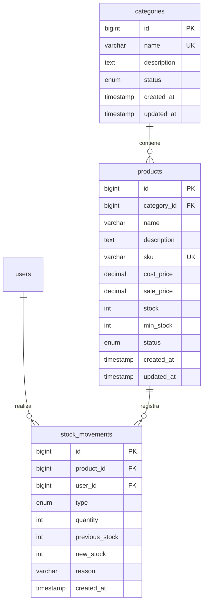

# Modelo de Datos: Capítulo 2 — Catálogo de Productos e Inventario

**Feature**: `002-catalogo-inventario`
**Date**: 2026-09-26
**Status**: Ready

---

## 1. Entidad: `Category` (Categorías de Productos)

Agrupación lógica para organizar el catálogo de productos de la tienda.

### Esquema de Base de Datos (`categories`)

| Campo | Tipo | Nulo | Índice / Clave | Descripción | Reglas de Validación |
|---|---|---|---|---|---|
| `id` | `BIGINT UNSIGNED` | No | Primary Key, Auto-increment | Identificador único de la categoría | - |
| `name` | `VARCHAR(100)` | No | Unique | Nombre visible de la categoría | Obligatorio, único, máx 100 caracteres |
| `description` | `TEXT` | Sí | - | Descripción opcional de la categoría | Opcional, máx 500 caracteres |
| `status` | `ENUM('active', 'inactive')` | No | Default: `active` | Estado de la categoría | Valores permitidos: `active`, `inactive` |
| `created_at` | `TIMESTAMP` | Sí | - | Fecha de creación | Autogenerado |
| `updated_at` | `TIMESTAMP` | Sí | - | Fecha de última actualización | Autogenerado |

### Relaciones

- **Category → Product**: One-to-Many. Una categoría tiene muchos productos (`products.category_id`).

---

## 2. Entidad: `Product` (Productos del Catálogo)

Artículo físico registrado en el inventario de la tienda.

### Esquema de Base de Datos (`products`)

| Campo | Tipo | Nulo | Índice / Clave | Descripción | Reglas de Validación |
|---|---|---|---|---|---|
| `id` | `BIGINT UNSIGNED` | No | Primary Key, Auto-increment | Identificador único del producto | - |
| `category_id` | `BIGINT UNSIGNED` | No | Foreign Key → `categories.id` | Categoría a la que pertenece | Obligatorio, debe existir en `categories` |
| `name` | `VARCHAR(200)` | No | Index | Nombre del producto | Obligatorio, máx 200 caracteres |
| `description` | `TEXT` | Sí | - | Descripción detallada del producto | Opcional, máx 2000 caracteres |
| `sku` | `VARCHAR(50)` | No | Unique | Código interno (SKU). Auto-generado si se omite | Único. Formato libre o auto: `CAT-NNNN` |
| `cost_price` | `DECIMAL(10,2)` | No | - | Precio de compra en Bs. (privado, solo Dueño) | Obligatorio, >= 0 |
| `sale_price` | `DECIMAL(10,2)` | No | - | Precio de venta al público en Bs. | Obligatorio, >= 0 |
| `stock` | `INT UNSIGNED` | No | Default: `0` | Cantidad actual en inventario | >= 0. En creación se asigna directamente; en edición solo vía ajuste de stock (HU8) |
| `min_stock` | `INT UNSIGNED` | No | Default: `0` | Umbral de alerta de stock bajo | >= 0. Si `stock <= min_stock`, se muestra alerta visual |
| `status` | `ENUM('active', 'inactive')` | No | Default: `active` | Estado del producto | Valores permitidos: `active`, `inactive` |
| `created_at` | `TIMESTAMP` | Sí | - | Fecha de creación | Autogenerado |
| `updated_at` | `TIMESTAMP` | Sí | - | Fecha de última actualización | Autogenerado |

### Relaciones

- **Product → Category**: Many-to-One. Un producto pertenece a una categoría (`category_id`).
- **Product → StockMovement**: One-to-Many. Un producto tiene muchos movimientos de stock.

### Campos derivados (no almacenados)

- **margin_amount**: `sale_price - cost_price` (calculado en frontend/API solo para el Dueño).
- **margin_percent**: `((sale_price - cost_price) / cost_price) * 100` (calculado solo si `cost_price > 0`).

---

## 3. Entidad: `StockMovement` (Movimientos de Stock)

Registro inmutable de cada ajuste de inventario realizado sobre un producto.

### Esquema de Base de Datos (`stock_movements`)

| Campo | Tipo | Nulo | Índice / Clave | Descripción | Reglas de Validación |
|---|---|---|---|---|---|
| `id` | `BIGINT UNSIGNED` | No | Primary Key, Auto-increment | Identificador único del movimiento | - |
| `product_id` | `BIGINT UNSIGNED` | No | Foreign Key → `products.id`, Index | Producto asociado | Obligatorio, debe existir en `products` |
| `user_id` | `BIGINT UNSIGNED` | No | Foreign Key → `users.id` | Usuario que realizó el ajuste | Obligatorio, debe existir en `users` |
| `type` | `ENUM('in', 'out')` | No | - | Tipo de movimiento: ingreso o egreso | Obligatorio |
| `quantity` | `INT UNSIGNED` | No | - | Cantidad ajustada (siempre positiva) | Obligatorio, > 0 |
| `previous_stock` | `INT UNSIGNED` | No | - | Stock antes del ajuste | Registrado automáticamente |
| `new_stock` | `INT UNSIGNED` | No | - | Stock después del ajuste | Registrado automáticamente |
| `reason` | `VARCHAR(255)` | No | - | Motivo del ajuste | Obligatorio, máx 255 caracteres |
| `created_at` | `TIMESTAMP` | Sí | - | Fecha y hora del ajuste | Autogenerado |

### Relaciones

- **StockMovement → Product**: Many-to-One (`product_id`).
- **StockMovement → User**: Many-to-One (`user_id`).

### Reglas de integridad

- **Inmutabilidad:** Los registros de `stock_movements` no se actualizan ni se eliminan.
- **Atomicidad:** El ajuste de stock y la creación del movimiento se ejecutan en una transacción de base de datos.
- **Stock no negativo:** Se valida que `new_stock >= 0` antes de persistir. Si `type = 'out'` y `quantity > previous_stock`, se rechaza la operación.

---

## 4. Reglas de Validación de Dominio

- **Unicidad de nombre de categoría:** No se permiten dos categorías con el mismo nombre (case-insensitive).
- **Unicidad de SKU:** No se permiten dos productos con el mismo SKU. La validación excluye al producto editado en operaciones de actualización.
- **Eliminación de categoría:** Solo se permite si la categoría no tiene productos asignados. Si tiene productos, el sistema solicita reasignación antes de eliminar.
- **Categoría inactiva:** Los productos de una categoría inactiva no aparecen en la vista del Vendedor, independientemente de su estado individual.
- **Producto inactivo:** No aparece en la vista del Vendedor. Sigue visible para el Dueño con indicador de estado.
- **Precio de venta < costo:** Permitido con advertencia visual; no se bloquea la operación (permite liquidaciones intencionales).
- **Stock en edición:** En productos existentes, el campo stock no se modifica desde el formulario de edición; solo se modifica mediante el ajuste rápido (HU8) para mantener la trazabilidad.

---

## 5. Diagrama de Relaciones



---

## 6. Datos Iniciales de Demostración (Seeder Opcional)

Para facilitar la validación visual, el seeder puede sembrar categorías de ejemplo:

```sql
INSERT INTO categories (name, description, status, created_at, updated_at) VALUES
('Laptops', 'Computadoras portátiles y notebooks', 'active', NOW(), NOW()),
('Componentes', 'Procesadores, memorias RAM, tarjetas de video, discos, fuentes', 'active', NOW(), NOW()),
('Periféricos', 'Teclados, ratones, monitores, audífonos', 'active', NOW(), NOW()),
('Accesorios', 'Cables, fundas, mochilas, adaptadores', 'active', NOW(), NOW());
```

Los productos de demostración se registran manualmente desde la interfaz durante la validación del quickstart.
