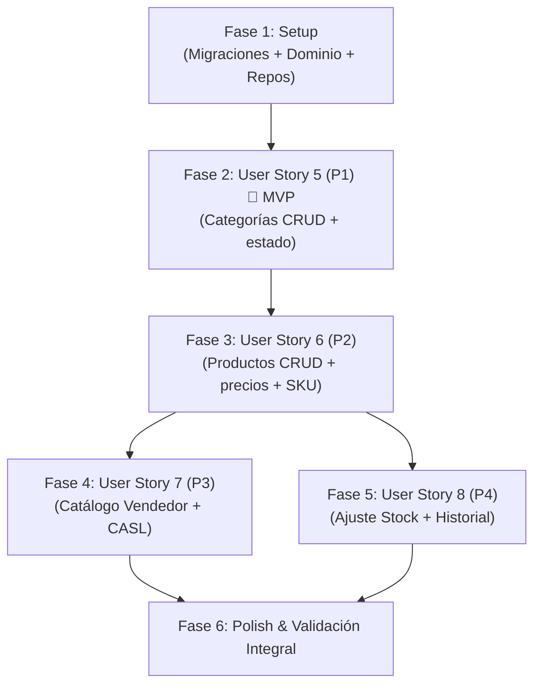

# Tasks: Capítulo 2 — Catálogo de Productos e Inventario

**Input**: Design documents from `specs/002-catalogo-inventario/`
**Prerequisites**: [plan.md](file:///c:/xampp/htdocs/servimatica-app/specs/002-catalogo-inventario/plan.md), [spec.md](file:///c:/xampp/htdocs/servimatica-app/specs/002-catalogo-inventario/spec.md), [research.md](file:///c:/xampp/htdocs/servimatica-app/specs/002-catalogo-inventario/research.md), [data-model.md](file:///c:/xampp/htdocs/servimatica-app/specs/002-catalogo-inventario/data-model.md), [contracts/](file:///c:/xampp/htdocs/servimatica-app/specs/002-catalogo-inventario/contracts/)

---

## Phase 1: Setup (Migraciones y Dominio Base)

**Purpose**: Crear las tablas de base de datos y las entidades de dominio que bloquean todas las historias de usuario.

- [X] T035 Crear migración para la tabla `categories` con campos: `id (BIGINT UNSIGNED PK)`, `name (VARCHAR(100) UNIQUE NOT NULL)`, `description (TEXT NULLABLE)`, `status (ENUM 'active','inactive' DEFAULT 'active')`, `timestamps` en `database/migrations/2026_09_26_000001_create_categories_table.php`
- [X] T036 Crear migración para la tabla `products` con campos: `id (BIGINT UNSIGNED PK)`, `category_id (BIGINT UNSIGNED FK → categories.id)`, `name (VARCHAR(200) NOT NULL INDEX)`, `description (TEXT NULLABLE)`, `sku (VARCHAR(50) UNIQUE NOT NULL)`, `cost_price (DECIMAL(10,2) NOT NULL)`, `sale_price (DECIMAL(10,2) NOT NULL)`, `stock (INT UNSIGNED DEFAULT 0)`, `min_stock (INT UNSIGNED DEFAULT 0)`, `status (ENUM 'active','inactive' DEFAULT 'active')`, `timestamps` en `database/migrations/2026_09_26_000002_create_products_table.php`
- [X] T037 Crear migración para la tabla `stock_movements` con campos: `id (BIGINT UNSIGNED PK)`, `product_id (BIGINT UNSIGNED FK → products.id INDEX)`, `user_id (BIGINT UNSIGNED FK → users.id)`, `type (ENUM 'in','out' NOT NULL)`, `quantity (INT UNSIGNED NOT NULL)`, `previous_stock (INT UNSIGNED NOT NULL)`, `new_stock (INT UNSIGNED NOT NULL)`, `reason (VARCHAR(255) NOT NULL)`, `created_at (TIMESTAMP)` en `database/migrations/2026_09_26_000003_create_stock_movements_table.php`
- [X] T038 [P] Implementar Entidad de Dominio `Category` y Value Objects en `app/Domain/Category/`
- [X] T039 [P] Implementar Entidad de Dominio `Product` y Value Objects en `app/Domain/Product/`
- [X] T040 [P] Implementar Entidad de Dominio `StockMovement` en `app/Domain/StockMovement/`
- [X] T041 [P] Implementar interfaz `CategoryRepositoryInterface` en `app/Domain/Category/CategoryRepositoryInterface.php` y su implementación Eloquent en `app/Infrastructure/Persistence/Eloquent/EloquentCategoryRepository.php`
- [X] T042 [P] Implementar interfaz `ProductRepositoryInterface` en `app/Domain/Product/ProductRepositoryInterface.php` y su implementación Eloquent en `app/Infrastructure/Persistence/Eloquent/EloquentProductRepository.php`
- [X] T043 [P] Implementar interfaz `StockMovementRepositoryInterface` en `app/Domain/StockMovement/StockMovementRepositoryInterface.php` y su implementación Eloquent en `app/Infrastructure/Persistence/Eloquent/EloquentStockMovementRepository.php`
- [X] T044 Registrar bindings de los tres repositorios en el ServiceProvider correspondiente en `app/Providers/AppServiceProvider.php`
- [X] T045 Crear seeder opcional con 4 categorías de demostración (Laptops, Componentes, Periféricos, Accesorios) en `database/seeders/CategorySeeder.php` y registrarlo en `DatabaseSeeder.php`

**Checkpoint**: Base de datos y arquitectura de dominio para catálogo lista. Migraciones ejecutables con `php artisan migrate`.

---

## Phase 2: User Story 5 — Gestión de Categorías (Prioridad: P1) 🎯 MVP

**Goal**: Permitir al Dueño crear, editar, activar/desactivar y eliminar categorías de productos con nombre único.
**Independent Test**: Crear las categorías "Laptops", "Componentes", "Periféricos" y "Accesorios", editar una, desactivar otra, e intentar crear un duplicado.

### Tests para User Story 5
- [X] T046 [P] [US5] Escribir prueba de integración para CRUD de categorías, unicidad de nombre, toggle-status y eliminación con productos asignados en `tests/Feature/Category/CategoryManagementTest.php`

### Implementación para User Story 5
- [X] T047 [US5] Implementar casos de uso `CreateCategoryUseCase`, `UpdateCategoryUseCase`, `ListCategoriesUseCase`, `ToggleCategoryStatusUseCase` y `DeleteCategoryUseCase` con validación de unicidad de nombre y bloqueo de eliminación con productos asignados en `app/Application/Category/`
- [X] T048 [US5] Implementar `CategoryController` con endpoints `GET /api/categories`, `POST /api/categories`, `PUT /api/categories/{id}`, `PATCH /api/categories/{id}/toggle-status` y `DELETE /api/categories/{id}` protegidos por middleware de rol `dueno` en `app/Infrastructure/Http/Controllers/Api/CategoryController.php`
- [X] T049 [US5] Registrar rutas de categorías en `routes/api.php` dentro del grupo `jwt.auth` + `owner`
- [X] T050 [US5] Extraer e implementar la vista de listado de categorías con tabla, búsqueda y acciones (editar, toggle-status, eliminar) desde `admin-full-version/` hacia `admin-starter-kit/src/pages/categories/index.vue`
- [X] T051 [US5] Implementar el drawer para alta y edición de categorías (campos: nombre obligatorio, descripción opcional) en `admin-starter-kit/src/views/categories/AddCategoryDrawer.vue`
- [X] T052 [US5] Conectar la acción de activar/desactivar categoría con confirmación visual y la acción de eliminar con advertencia de productos vinculados en `admin-starter-kit/src/pages/categories/index.vue`

**Checkpoint**: El Dueño administra categorías desde el panel web. MVP del catálogo operativo.

---

## Phase 3: User Story 6 — Registro y Edición de Productos (Prioridad: P2)

**Goal**: Permitir al Dueño registrar y editar productos con nombre, categoría, SKU (auto-generado si se omite), precios de compra/venta en Bs., stock inicial, stock mínimo y estado.
**Independent Test**: Registrar una "Laptop HP 15-ef2xxx" con costo Bs. 2.500, precio venta Bs. 3.200, stock 3, y verificar que aparece con el margen calculado (Bs. 700, 28%).

### Tests para User Story 6
- [X] T053 [P] [US6] Escribir prueba de integración para CRUD de productos, unicidad de SKU, auto-generación de SKU, validación de campos obligatorios, toggle-status y filtrado por rol (Dueño ve costos, Vendedor no) en `tests/Feature/Product/ProductManagementTest.php`

### Implementación para User Story 6
- [X] T054 [US6] Implementar lógica de auto-generación de SKU: formato `CAT-NNNN` (3 letras de categoría + correlativo) cuando el Dueño no proporciona SKU, en el caso de uso o repositorio correspondiente
- [X] T055 [US6] Implementar casos de uso `CreateProductUseCase`, `UpdateProductUseCase`, `ListProductsUseCase` y `ToggleProductStatusUseCase` con validación de unicidad SKU, campos obligatorios, y serialización condicional por rol (excluir `cost_price` y `min_stock` para vendedor) en `app/Application/Product/`
- [X] T056 [US6] Implementar `ProductController` con endpoints `GET /api/products` (paginado, filtrado por search/category_id/status, respuesta diferenciada por rol), `POST /api/products`, `PUT /api/products/{id}` (ignora campo stock en edición) y `PATCH /api/products/{id}/toggle-status` en `app/Infrastructure/Http/Controllers/Api/ProductController.php`
- [X] T057 [US6] Registrar rutas de productos en `routes/api.php`: `GET /api/products` accesible para ambos roles (jwt.auth), `POST`, `PUT` y `PATCH toggle-status` solo para Dueño (owner)
- [X] T058 [US6] Extraer e implementar la vista de listado de productos con tabla paginada, búsqueda por nombre/SKU, filtro por categoría, columnas diferenciadas por rol (Dueño: costo, margen Bs./%, stock mínimo; Vendedor: solo precio venta y stock), badges de "Stock bajo" y "Agotado" desde `admin-full-version/` hacia `admin-starter-kit/src/pages/products/index.vue`
- [X] T059 [US6] Implementar el drawer para alta y edición de productos (campos: nombre, descripción, categoría select, SKU opcional, costo Bs., precio venta Bs., stock solo en creación, stock mínimo) con advertencia visual si precio venta < costo y cálculo de margen en tiempo real en `admin-starter-kit/src/views/products/AddProductDrawer.vue`
- [X] T060 [US6] Conectar la acción de activar/desactivar producto con confirmación visual en `admin-starter-kit/src/pages/products/index.vue`

**Checkpoint**: El Dueño registra y gestiona productos con precios, márgenes y estados.

---

## Phase 4: User Story 7 — Consulta del Catálogo por el Vendedor (Prioridad: P3)

**Goal**: Permitir al Vendedor buscar productos activos por nombre, categoría o SKU, viendo solo precio de venta y stock, sin acceso a costos ni márgenes.
**Independent Test**: Iniciar sesión como vendedor, buscar "Laptop HP" y verificar que aparece con precio Bs. 3.200 y stock 3 sin mostrar costo de compra. Verificar que productos inactivos y de categorías inactivas no aparecen.

### Tests para User Story 7
- [X] T061 [P] [US7] Escribir prueba de integración para restricción de datos financieros al vendedor, ocultamiento de productos inactivos y de categorías inactivas, y búsqueda/filtrado en `tests/Feature/Product/CatalogAccessTest.php`

### Implementación para User Story 7
- [X] T062 [US7] Configurar reglas de CASL en `admin-starter-kit/src/plugins/casl/ability.js` para otorgar al vendedor permisos de lectura sobre `Product` (sin campos financieros) y denegar acceso a `Category` (gestión)
- [X] T063 [US7] Adaptar la navegación en `admin-starter-kit/src/navigation/vertical/index.js` para mostrar el grupo "Catálogo" con: Dueño ve "Categorías" y "Productos"; Vendedor solo ve "Productos"
- [X] T064 [US7] Ajustar la vista de productos en `admin-starter-kit/src/pages/products/index.vue` para ocultar columnas de costo, margen y stock mínimo con directivas CASL (`v-if="can('manage', 'Product')"`) y ocultar el botón "Nuevo producto" y acciones de edición/estado/stock para el Vendedor
- [X] T065 [US7] Verificar que el endpoint `GET /api/products` con token de Vendedor filtra categorías inactivas (`categories.status = 'active'`) y productos inactivos (`products.status = 'active'`) y excluye `cost_price` y `min_stock` de la respuesta JSON

**Checkpoint**: El Vendedor opera un catálogo seguro y restringido a su labor de mostrador.

---

## Phase 5: User Story 8 — Ajuste Rápido de Stock e Historial (Prioridad: P4)

**Goal**: Permitir al Dueño ajustar el stock (incremento/decremento con motivo obligatorio) y consultar el historial de movimientos con filtros por fecha y tipo.
**Independent Test**: Incrementar el stock de "Laptop HP" de 3 a 6 con motivo "Recepción de mercadería", verificar que el nuevo stock se refleja en la lista del Vendedor, y consultar el historial filtrado.

### Tests para User Story 8
- [X] T066 [P] [US8] Escribir prueba de integración para ajuste de stock (incremento, decremento, rechazo de stock negativo), historial inmutable, filtros por fecha/tipo y restricción al vendedor en `tests/Feature/Stock/StockAdjustmentTest.php`

### Implementación para User Story 8
- [X] T067 [US8] Implementar casos de uso `AdjustStockUseCase` (transacción atómica: validar stock disponible + actualizar producto + crear StockMovement) y `ListStockMovementsUseCase` (paginado con filtros por tipo y rango de fechas) en `app/Application/StockMovement/`
- [X] T068 [US8] Implementar endpoints `POST /api/products/{id}/stock` (ajuste con validación: quantity > 0, motivo obligatorio máx 255, rechazo si egreso > stock actual) y `GET /api/products/{id}/stock-history` (paginado con filtros `type`, `from`, `to`) protegidos por middleware `owner` en `app/Infrastructure/Http/Controllers/Api/ProductController.php`
- [X] T069 [US8] Registrar rutas de stock en `routes/api.php`: `POST /api/products/{id}/stock` y `GET /api/products/{id}/stock-history` dentro del grupo `jwt.auth` + `owner`
- [X] T070 [US8] Implementar el diálogo de ajuste de stock (campos: tipo select in/out, cantidad numérica > 0, motivo obligatorio) mostrando el stock actual y el stock resultante en tiempo real en `admin-starter-kit/src/views/products/StockAdjustDialog.vue`
- [X] T071 [US8] Implementar la vista de historial de movimientos de stock por producto con tabla paginada, filtros por tipo (ingreso/egreso) y rango de fechas, accesible desde un botón en la fila del producto en `admin-starter-kit/src/pages/products/history/[id].vue`
- [X] T072 [US8] Conectar el botón de ajuste de stock y el botón de historial en la fila de cada producto en `admin-starter-kit/src/pages/products/index.vue` (solo visible para el Dueño)

**Checkpoint**: El Dueño ajusta stock con trazabilidad completa y consulta el historial de movimientos.

---

## Phase 6: Polish & Validación Integral

**Purpose**: Verificación de extremo a extremo y garantía de calidad antes de cerrar el capítulo.

- [X] T073 [P] Ejecutar la suite completa de pruebas automatizadas con `php artisan test` (incluye tests del Capítulo 1 y Capítulo 2)
- [X] T074 [P] Ejecutar `pnpm run build` en `admin-starter-kit/` para verificar compilación de producción sin errores
- [X] T075 Ejecutar y comprobar los 6 escenarios de prueba manual descritos en [quickstart.md](file:///c:/xampp/htdocs/servimatica-app/specs/002-catalogo-inventario/quickstart.md)
- [X] T076 Verificar el estricto cumplimiento de la Constitución v1.0.0 y las directivas de [AGENTS.md](file:///c:/xampp/htdocs/servimatica-app/AGENTS.md) (entorno local en `http://servimatica-app.test`, sin `artisan serve`, componentes reutilizados de `admin-full-version/`, precios en Bs.)

---

## Dependencies & Execution Order

### User Story Dependencies

- **US5 (Categorías)**: Depende de Phase 1 (Setup). Sin dependencias de otras historias.
- **US6 (Productos)**: Depende de US5 (necesita categorías existentes para asignar productos).
- **US7 (Catálogo Vendedor)**: Depende de US6 (necesita productos registrados para consultar). Puede ejecutarse en paralelo con US8.
- **US8 (Ajuste Stock)**: Depende de US6 (necesita productos registrados para ajustar stock). Puede ejecutarse en paralelo con US7.

---

## Implementation Strategy: MVP First

1. **Paso 1:** Migraciones y entidades de dominio (Fase 1).
2. **Paso 2:** CRUD de categorías — **MVP del catálogo** (Fase 2).
3. **Paso 3:** Registro y gestión de productos con precios y márgenes (Fase 3).
4. **Paso 4:** Catálogo de consulta del Vendedor con restricciones CASL (Fase 4) **en paralelo con** ajuste de stock e historial (Fase 5).
5. **Paso 5:** Validación integral y verificación visual (Fase 6).
