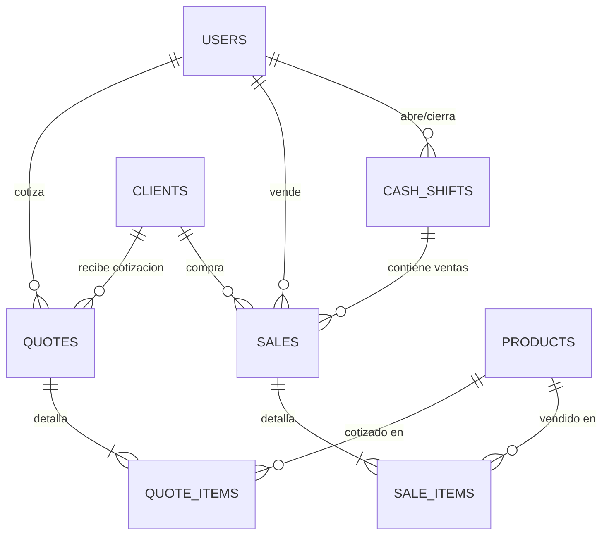

# Data Model: Capítulo 4 — Ventas, Proformas, Caja y Comisiones

**Feature**: `004-ventas-proformas-pos`  
**Date**: 2026-10-03  
**Status**: Ready for Implementation

Este documento describe el esquema relacional, tipos de datos, índices y transiciones de estado para el módulo de Punto de Venta, Proformas, Turnos de Caja y Comisiones.

---

## 1. Diagrama de Relaciones Entidad-Relación (ERD)

---

## 2. Definición Detallada de Tablas

### 2.1. Tabla `clients` (Clientes)
Almacena el directorio de clientes frecuentes y permite asignar ventas/proformas.

| Campo | Tipo | Nulo | Por Defecto | Descripción |
|---|---|:---:|:---:|---|
| `id` | `BIGINT UNSIGNED` | NO | Auto-inc | Clave primaria |
| `name` | `VARCHAR(150)` | NO | — | Nombre completo o Razón Social |
| `nit_ci` | `VARCHAR(30)` | SÍ | `NULL` | Número de NIT o Carnet de Identidad (indexado) |
| `phone` | `VARCHAR(30)` | SÍ | `NULL` | Número de teléfono celular / WhatsApp |
| `email` | `VARCHAR(100)` | SÍ | `NULL` | Correo electrónico |
| `address` | `VARCHAR(255)` | SÍ | `NULL` | Dirección de entrega / domicilio |
| `is_active` | `BOOLEAN` | NO | `TRUE` | Estado de actividad del cliente |
| `created_at` | `TIMESTAMP` | SÍ | `NULL` | Fecha de creación |
| `updated_at` | `TIMESTAMP` | SÍ | `NULL` | Fecha de actualización |

- **Índices**: `INDEX (nit_ci)`, `INDEX (phone)`, `INDEX (name)`.

---

### 2.2. Tabla `cash_shifts` (Turnos / Sesiones de Caja)
Controla la apertura y cierre de caja diaria para el manejo de efectivo en mostrador.

| Campo | Tipo | Nulo | Por Defecto | Descripción |
|---|---|:---:|:---:|---|
| `id` | `BIGINT UNSIGNED` | NO | Auto-inc | Clave primaria |
| `user_id` | `BIGINT UNSIGNED` | NO | — | FK → `users.id` (Cajero/Vendedor responsable) |
| `opening_amount` | `DECIMAL(10,2)` | NO | `0.00` | Fondo inicial de caja en Bolivianos (`Bs.`) |
| `closing_amount` | `DECIMAL(10,2)` | SÍ | `NULL` | Efectivo físico real contado al cierre en `Bs.` |
| `expected_amount` | `DECIMAL(10,2)` | SÍ | `NULL` | Efectivo calculado esperado (inicial + ventas efectivo) |
| `difference` | `DECIMAL(10,2)` | SÍ | `NULL` | Diferencia al cierre: `closing - expected` (sobrante/faltante) |
| `total_cash_sales` | `DECIMAL(10,2)` | NO | `0.00` | Total acumulado de ventas cobradas en efectivo |
| `total_qr_sales` | `DECIMAL(10,2)` | NO | `0.00` | Total acumulado de ventas cobradas por QR/transferencia |
| `status` | `ENUM` | NO | `'open'` | `'open'` (Caja abierta) o `'closed'` (Caja cerrada) |
| `opened_at` | `TIMESTAMP` | NO | `CURRENT_TIMESTAMP` | Fecha y hora de apertura |
| `closed_at` | `TIMESTAMP` | SÍ | `NULL` | Fecha y hora de cierre |
| `notes` | `TEXT` | SÍ | `NULL` | Observaciones o justificativo de discrepancia |
| `created_at` | `TIMESTAMP` | SÍ | `NULL` | Timestamps |
| `updated_at` | `TIMESTAMP` | SÍ | `NULL` | Timestamps |

- **Restricciones e Índices**:
  - `FOREIGN KEY (user_id) REFERENCES users(id) ON DELETE RESTRICT`
  - `INDEX (user_id, status)`

---

### 2.3. Tabla `quotes` (Proformas / Cotizaciones)
Presupuestos emitidos sin descontar inventario físico.

| Campo | Tipo | Nulo | Por Defecto | Descripción |
|---|---|:---:|:---:|---|
| `id` | `BIGINT UNSIGNED` | NO | Auto-inc | Clave primaria |
| `quote_number` | `VARCHAR(30)` | NO | — | Código correlativo único (ej. `PRF-000001`) |
| `seller_id` | `BIGINT UNSIGNED` | NO | — | FK → `users.id` (Vendedor que cotizó) |
| `client_id` | `BIGINT UNSIGNED` | SÍ | `NULL` | FK → `clients.id` (Opcional, NULL si es cliente libre) |
| `client_name` | `VARCHAR(150)` | NO | `'Cliente General'` | Nombre del cliente cotizado |
| `client_phone` | `VARCHAR(30)` | SÍ | `NULL` | Teléfono para envío WhatsApp |
| `subtotal` | `DECIMAL(10,2)` | NO | `0.00` | Suma de subtotales de productos en `Bs.` |
| `discount_amount` | `DECIMAL(10,2)` | NO | `0.00` | Descuento aplicado en `Bs.` |
| `total_amount` | `DECIMAL(10,2)` | NO | `0.00` | Monto final cotizado en `Bs.` |
| `valid_until` | `DATE` | NO | — | Fecha límite de vigencia de la proforma |
| `status` | `ENUM` | NO | `'active'` | `'active'`, `'converted'` (vendida), `'expired'`, `'cancelled'` |
| `notes` | `TEXT` | SÍ | `NULL` | Términos de entrega o garantía |
| `created_at` | `TIMESTAMP` | SÍ | `NULL` | Timestamps |
| `updated_at` | `TIMESTAMP` | SÍ | `NULL` | Timestamps |

- **Restricciones e Índices**:
  - `UNIQUE INDEX (quote_number)`
  - `FOREIGN KEY (seller_id) REFERENCES users(id) ON DELETE RESTRICT`
  - `FOREIGN KEY (client_id) REFERENCES clients(id) ON DELETE SET NULL`
  - `INDEX (status)`

---

### 2.4. Tabla `quote_items` (Detalle de Proforma)

| Campo | Tipo | Nulo | Por Defecto | Descripción |
|---|---|:---:|:---:|---|
| `id` | `BIGINT UNSIGNED` | NO | Auto-inc | Clave primaria |
| `quote_id` | `BIGINT UNSIGNED` | NO | — | FK → `quotes.id` ON DELETE CASCADE |
| `product_id` | `BIGINT UNSIGNED` | NO | — | FK → `products.id` ON DELETE RESTRICT |
| `product_name` | `VARCHAR(200)` | NO | — | Nombre congelado del producto en el momento |
| `quantity` | `INT UNSIGNED` | NO | `1` | Cantidad cotizada |
| `unit_price` | `DECIMAL(10,2)` | NO | `0.00` | Precio unitario cotizado en `Bs.` |
| `subtotal` | `DECIMAL(10,2)` | NO | `0.00` | `quantity * unit_price` en `Bs.` |

---

### 2.5. Tabla `sales` (Ventas Concretadas)
Transacciones económicas confirmadas que descuentan stock.

| Campo | Tipo | Nulo | Por Defecto | Descripción |
|---|---|:---:|:---:|---|
| `id` | `BIGINT UNSIGNED` | NO | Auto-inc | Clave primaria |
| `invoice_number` | `VARCHAR(30)` | NO | — | Código correlativo único (ej. `VNT-000001`) |
| `quote_id` | `BIGINT UNSIGNED` | SÍ | `NULL` | FK → `quotes.id` (Si la venta provino de proforma) |
| `seller_id` | `BIGINT UNSIGNED` | NO | — | FK → `users.id` (Vendedor responsable) |
| `client_id` | `BIGINT UNSIGNED` | SÍ | `NULL` | FK → `clients.id` |
| `client_name` | `VARCHAR(150)` | NO | `'Cliente Mostrador'` | Nombre o Razón Social del cliente |
| `client_nit_ci` | `VARCHAR(30)` | SÍ | `NULL` | NIT o CI del cliente |
| `cash_shift_id` | `BIGINT UNSIGNED` | NO | — | FK → `cash_shifts.id` (Turno de caja donde se cobró) |
| `payment_method` | `ENUM` | NO | `'efectivo'` | `'efectivo'`, `'qr'`, `'transferencia'` |
| `subtotal` | `DECIMAL(10,2)` | NO | `0.00` | Suma de precios en `Bs.` |
| `discount_amount` | `DECIMAL(10,2)` | NO | `0.00` | Descuento total aplicado en `Bs.` |
| `total_amount` | `DECIMAL(10,2)` | NO | `0.00` | Monto neto cobrado en Bolivianos (`Bs.`) |
| `cash_tendered` | `DECIMAL(10,2)` | SÍ | `NULL` | Monto entregado en efectivo por el cliente en `Bs.` |
| `change_due` | `DECIMAL(10,2)` | SÍ | `0.00` | Cambio / vuelto entregado en `Bs.` |
| `commission_rate` | `DECIMAL(5,2)` | NO | `0.00` | Porcentaje de comisión congelado (%) |
| `commission_amount`| `DECIMAL(10,2)` | NO | `0.00` | Monto ganado por comisión en `Bs.` |
| `status` | `ENUM` | NO | `'completed'` | `'completed'` (Completada), `'cancelled'` (Anulada) |
| `cancellation_reason`| `VARCHAR(255)`| SÍ | `NULL` | Motivo de anulación (exclusivo Dueño) |
| `cancelled_by` | `BIGINT UNSIGNED` | SÍ | `NULL` | FK → `users.id` (Dueño que anuló) |
| `cancelled_at` | `TIMESTAMP` | SÍ | `NULL` | Fecha de anulación |
| `created_at` | `TIMESTAMP` | SÍ | `NULL` | Fecha y hora de la venta |
| `updated_at` | `TIMESTAMP` | SÍ | `NULL` | Timestamps |

- **Restricciones e Índices**:
  - `UNIQUE INDEX (invoice_number)`
  - `FOREIGN KEY (seller_id) REFERENCES users(id) ON DELETE RESTRICT`
  - `FOREIGN KEY (client_id) REFERENCES clients(id) ON DELETE SET NULL`
  - `FOREIGN KEY (cash_shift_id) REFERENCES cash_shifts(id) ON DELETE RESTRICT`
  - `INDEX (status)`, `INDEX (created_at)`

---

### 2.6. Tabla `sale_items` (Detalle de Venta)

| Campo | Tipo | Nulo | Por Defecto | Descripción |
|---|---|:---:|:---:|---|
| `id` | `BIGINT UNSIGNED` | NO | Auto-inc | Clave primaria |
| `sale_id` | `BIGINT UNSIGNED` | NO | — | FK → `sales.id` ON DELETE CASCADE |
| `product_id` | `BIGINT UNSIGNED` | NO | — | FK → `products.id` ON DELETE RESTRICT |
| `product_name` | `VARCHAR(200)` | NO | — | Nombre congelado del producto |
| `product_sku` | `VARCHAR(50)` | NO | — | SKU congelado del producto |
| `quantity` | `INT UNSIGNED` | NO | `1` | Cantidad vendida |
| `unit_cost` | `DECIMAL(10,2)` | NO | `0.00` | Costo de compra en `Bs.` (confidencial para balance) |
| `unit_price` | `DECIMAL(10,2)` | NO | `0.00` | Precio unitario de venta en `Bs.` |
| `subtotal` | `DECIMAL(10,2)` | NO | `0.00` | `quantity * unit_price` en `Bs.` |

---

## 3. Máquinas de Estado y Transiciones

### Estado de Proforma (`quotes.status`):
- `active` → `converted` (al convertirse en venta final).
- `active` → `cancelled` (cancelada por el cliente).
- `active` → `expired` (cuando la fecha actual supera `valid_until`).

### Estado de Venta (`sales.status`):
- `completed` → `cancelled` (solo el Dueño puede anular la venta; la acción repone el stock a `products` y descuenta el total de caja/comisión).
