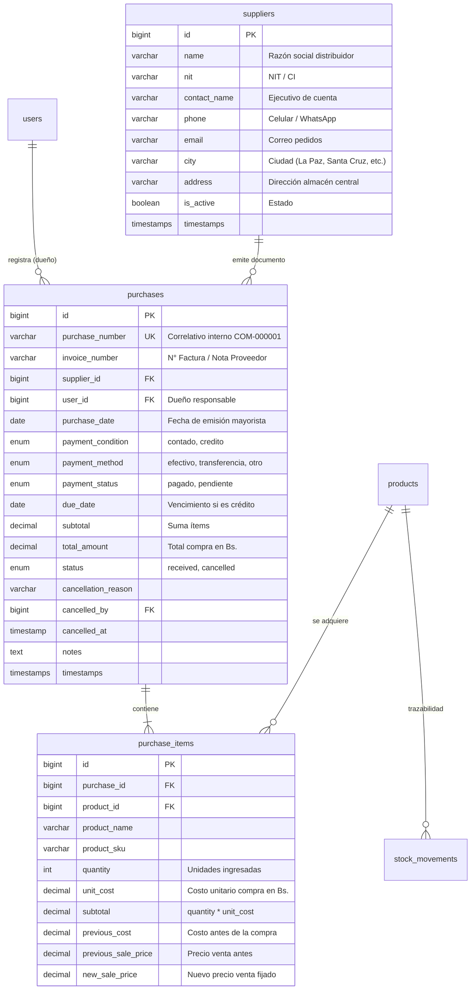

# Modelo de Datos: Capítulo 5 — Compras y Proveedores

**Feature**: `specs/005-compras-proveedores-stock`  
**Date**: 2026-10-03  

---

## 1. Diagrama Entidad-Relación

---

## 2. Esquema Relacional Detallado

### Tabla `suppliers`
| Columna | Tipo | Nulo | Índice | Descripción |
|---|---|---|---|---|
| `id` | `BIGINT UNSIGNED` | NO | PK | Identificador único |
| `name` | `VARCHAR(150)` | NO | INDEX | Razón Social de la empresa distribuidora |
| `nit` | `VARCHAR(30)` | SÍ | INDEX | NIT o documento fiscal |
| `contact_name` | `VARCHAR(100)` | SÍ | | Nombre del ejecutivo de ventas |
| `phone` | `VARCHAR(30)` | SÍ | INDEX | Teléfono o WhatsApp de contacto |
| `email` | `VARCHAR(100)` | SÍ | | Correo electrónico de cotizaciones |
| `city` | `VARCHAR(50)` | SÍ | | Ciudad (Cochabamba, Santa Cruz, La Paz, etc.) |
| `address` | `VARCHAR(255)` | SÍ | | Dirección física del almacén |
| `is_active` | `BOOLEAN` | NO | INDEX | `true` = Activo, `false` = Inactivo |
| `created_at` / `updated_at` | `TIMESTAMP` | SÍ | | Tiempos de creación y modificación |

### Tabla `purchases`
| Columna | Tipo | Nulo | Índice | Descripción |
|---|---|---|---|---|
| `id` | `BIGINT UNSIGNED` | NO | PK | Identificador único |
| `purchase_number` | `VARCHAR(30)` | NO | UNIQUE | Correlativo interno `COM-XXXXXX` |
| `invoice_number` | `VARCHAR(50)` | NO | INDEX | N° de Factura o Nota de Entrega del mayorista |
| `supplier_id` | `BIGINT UNSIGNED` | NO | FK | Referencia a `suppliers.id` |
| `user_id` | `BIGINT UNSIGNED` | NO | FK | Dueño que registra la compra (`users.id`) |
| `purchase_date` | `DATE` | NO | INDEX | Fecha consignada en la factura mayorista |
| `payment_condition` | `ENUM('contado','credito')` | NO | | Condición de pago |
| `payment_method` | `ENUM('efectivo','transferencia','otro')` | NO | | Método de liquidación |
| `payment_status` | `ENUM('pagado','pendiente')` | NO | INDEX | Estado de pago a distribuidor |
| `due_date` | `DATE` | SÍ | | Fecha límite de pago si es crédito |
| `subtotal` | `DECIMAL(12,2)` | NO | | Suma de subtotales en Bs. |
| `total_amount` | `DECIMAL(12,2)` | NO | | Total neto liquidado en Bs. |
| `status` | `ENUM('received','cancelled')` | NO | INDEX | `received` = Activa/Ingresada, `cancelled` = Anulada |
| `cancellation_reason` | `VARCHAR(255)` | SÍ | | Justificación de la anulación |
| `cancelled_by` | `BIGINT UNSIGNED` | SÍ | FK | Dueño que anuló la recepción (`users.id`) |
| `cancelled_at` | `TIMESTAMP` | SÍ | | Fecha y hora de anulación |
| `notes` | `TEXT` | SÍ | | Observaciones y condiciones |
| `created_at` / `updated_at` | `TIMESTAMP` | SÍ | INDEX | Tiempos de registro en el sistema |

### Tabla `purchase_items`
| Columna | Tipo | Nulo | Índice | Descripción |
|---|---|---|---|---|
| `id` | `BIGINT UNSIGNED` | NO | PK | Identificador único |
| `purchase_id` | `BIGINT UNSIGNED` | NO | FK | Referencia a `purchases.id` (`cascadeOnDelete`) |
| `product_id` | `BIGINT UNSIGNED` | NO | FK | Referencia a `products.id` (`restrictOnDelete`) |
| `product_name` | `VARCHAR(200)` | NO | | Snapshot del nombre del producto |
| `product_sku` | `VARCHAR(50)` | NO | | Snapshot del código SKU |
| `quantity` | `INT UNSIGNED` | NO | | Unidades recepcionadas |
| `unit_cost` | `DECIMAL(10,2)` | NO | | Costo unitario de compra facturado en Bs. |
| `subtotal` | `DECIMAL(12,2)` | NO | | `quantity * unit_cost` |
| `previous_cost` | `DECIMAL(10,2)` | SÍ | | Costo unitario que tenía antes de esta compra |
| `previous_sale_price` | `DECIMAL(10,2)` | SÍ | | Precio venta que tenía antes de esta compra |
| `new_sale_price` | `DECIMAL(10,2)` | SÍ | | Nuevo precio de venta al público fijado en Bs. |
