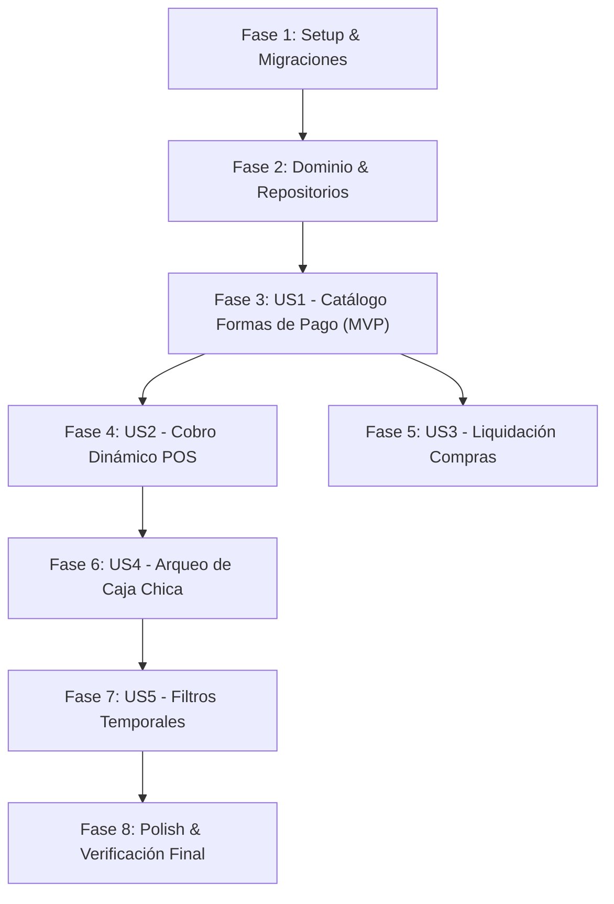

# Tasks: Capítulo 6 — Gestión Centralizada de Formas de Pago, Cuentas Bancarias y Conciliación

**Feature Branch**: `006-gestion-formas-pago` | **Date**: 2026-10-03 | **Spec**: [spec.md](spec.md) | **Plan**: [plan.md](plan.md)

---

## Phase 1: Setup (Infraestructura y Migraciones Base)

**Purpose**: Estructura de base de datos, directorio de storage y seeders iniciales.

- [x] T001 Crear migración `2026_10_03_000013_create_payment_methods_table.php` con campos `name`, `type`, `bank_name`, `account_number`, `account_holder`, `qr_image_path`, `requires_reference`, `applies_to`, `sort_order`, `is_active`.
- [x] T002 Crear migración `2026_10_03_000014_add_payment_method_id_to_sales_and_purchases.php` agregando `payment_method_id` y `reference_number` a `sales`, `purchases` y `quotes`.
- [x] T003 [P] Crear seeder inicial `database/seeders/PaymentMethodSeeder.php` con métodos por defecto (*Efectivo en Mostrador*, *QR Simple Banco Unión*, *Transferencia Bancaria BCP*).
- [x] T004 [P] Configurar el symlink y directorio de almacenamiento `storage/app/public/payment-methods/`.

---

## Phase 2: Foundational (Dominio y Repositorios Hexagonales)

**Purpose**: Clases de dominio puro, enums/Value Objects e interfaces que soportan todas las historias de usuario.

- [x] T005 [P] Crear Value Objects `app/Domain/PaymentMethod/PaymentMethodType.php` y `app/Domain/PaymentMethod/PaymentMethodScope.php`.
- [x] T006 [P] Crear entidad de dominio `app/Domain/PaymentMethod/PaymentMethod.php` con métodos `isCash()`, `isDigital()`, `toggleStatus()` y `toArray()`.
- [x] T007 [P] Crear interfaz de repositorio `app/Domain/PaymentMethod/PaymentMethodRepositoryInterface.php`.
- [x] T008 Crear modelo Eloquent `app/Infrastructure/Persistence/Eloquent/PaymentMethodModel.php` con casts de tipos y mutators para URL pública de QR.
- [x] T009 Implementar repositorio `app/Infrastructure/Persistence/Eloquent/EloquentPaymentMethodRepository.php` vinculándolo en `app/Providers/AppServiceProvider.php`.

**Checkpoint**: Base de datos y arquitectura hexagonal listas para casos de uso y endpoints.

---

## Phase 3: User Story 1 - Catálogo y Parametrización de Formas de Pago por el Dueño (Priority: P1) 🎯 MVP

**Goal**: Permitir al Dueño administrar cuentas bancarias, subir la imagen del QR de cobro, definir si exige referencia y activar/desactivar métodos.

**Independent Test**: El Dueño accede a `/payment-methods`, crea *"QR Banco Unión"* con imagen adjunta y número de cuenta; verifica que aparezca activa y que un usuario Vendedor reciba `403 Forbidden`.

### Tests para User Story 1
- [x] T010 [P] [US1] Escribir prueba de Feature `tests/Feature/PaymentMethod/PaymentMethodManagementTest.php` validando CRUD de Dueño, subida de imagen QR, validaciones y bloqueo estricto al rol Vendedor.

### Implementación Backend para User Story 1
- [x] T011 [P] [US1] Crear caso de uso `app/Application/PaymentMethod/ListPaymentMethodsUseCase.php`.
- [x] T012 [P] [US1] Crear caso de uso `app/Application/PaymentMethod/CreatePaymentMethodUseCase.php` con procesamiento de imagen QR en storage.
- [x] T013 [P] [US1] Crear caso de uso `app/Application/PaymentMethod/UpdatePaymentMethodUseCase.php`.
- [x] T014 [P] [US1] Crear caso de uso `app/Application/PaymentMethod/TogglePaymentMethodStatusUseCase.php`.
- [x] T015 [US1] Implementar controlador API `app/Infrastructure/Http/Controllers/Api/PaymentMethodController.php` con endpoints protegidos por middleware `auth:api` y `owner`.
- [x] T016 [US1] Registrar rutas en `routes/api.php` (`/api/payment-methods`, `/api/payment-methods/{id}`, `/api/payment-methods/{id}/toggle-status`).

### Implementación Frontend Web para User Story 1
- [x] T017 [P] [US1] Crear diálogo modal `admin-starter-kit/src/views/payment-methods/PaymentMethodDialog.vue` para dar de alta/editar métodos con upload y preview de imagen QR.
- [x] T018 [US1] Crear página principal `admin-starter-kit/src/pages/payment-methods/index.vue` con tabla Vuetify compacta, switches de activación y acciones CRUD.
- [x] T019 [US1] Agregar ítem en menú lateral `admin-starter-kit/src/navigation/vertical/index.js` bajo `Ajustes > Formas de Pago` condicionado a permiso de Dueño en CASL.

**Checkpoint**: User Story 1 funcional y comprobable independientemente como MVP.

---

## Phase 4: User Story 2 - Cobro Dinámico en POS con Despliegue de QR Oficial (Priority: P2)

**Goal**: El Punto de Venta carga dinámicamente los métodos de pago activos para ventas, proyecta el QR oficial en pantalla al cobrar y captura el comprobante bancario.

**Independent Test**: Agregar productos al carrito en el POS, presionar "Cobrar", seleccionar *"QR Banco Unión"*, verificar que el QR se proyecte en pantalla con el monto exacto en `Bs.`, ingresar referencia y confirmar la venta.

### Tests para User Story 2
- [x] T020 [P] [US2] Escribir prueba `tests/Feature/Sale/PosDynamicPaymentSaleTest.php` validando registro de venta con `payment_method_id` y validación de `reference_number` obligatorio.

### Implementación Backend para User Story 2
- [x] T021 [P] [US2] Crear caso de uso `app/Application/PaymentMethod/GetPaymentMethodOptionsUseCase.php` para listar métodos activos por contexto (`sales`, `purchases`).
- [x] T022 [US2] Exponer endpoint público autenticado `GET /api/payment-methods/options` en `PaymentMethodController.php`.
- [x] T023 [US2] Actualizar `app/Application/Sale/ProcessSaleUseCase.php` y `app/Infrastructure/Persistence/Eloquent/SaleModel.php` para persistir `payment_method_id` y `reference_number`.

### Implementación Frontend Web para User Story 2
- [x] T024 [US2] Modificar `admin-starter-kit/src/views/pos/CheckoutDialog.vue` para consumir `/api/payment-methods/options?context=sales`.
- [x] T025 [US2] Implementar en `CheckoutDialog.vue` el visor de código QR en alta resolución con datos de transferencia y el campo reactivo para el número de comprobante/referencia obligatoria.
- [x] T026 [US2] Actualizar el ticket térmico de venta `admin-starter-kit/src/views/pos/ReceiptPrintDialog.vue` y `resources/views/sales/receipt.blade.php` para imprimir el nombre del banco y el código de comprobante.

**Checkpoint**: User Story 2 integrada y verificable con cobros reales en mostrador.

---

## Phase 5: User Story 3 - Liquidación Dinámica en Compras a Proveedores (Priority: P3)

**Goal**: Permitir seleccionar la forma de pago o cuenta bancaria corporativa de egreso al recepcionar compras mayoristas.

**Independent Test**: En `/purchases/create`, seleccionar proveedor, cargar ítems y en "Método de Liquidación" seleccionar una cuenta bancaria activa, confirmando la recepción y guardando la relación.

### Tests para User Story 3
- [x] T027 [P] [US3] Escribir prueba `tests/Feature/Purchase/PurchasePaymentMethodTest.php` comprobando que las compras registren el `payment_method_id` de egreso.

### Implementación Backend y Frontend para User Story 3
- [x] T028 [US3] Actualizar `app/Application/Purchase/ProcessPurchaseUseCase.php` y `app/Infrastructure/Persistence/Eloquent/PurchaseModel.php` para recibir y guardar `payment_method_id` y `reference_number`.
- [x] T029 [US3] Actualizar `admin-starter-kit/src/pages/purchases/create.vue` para poblar el selector *"Método de Liquidación"* desde `/api/payment-methods/options?context=purchases`.
- [x] T030 [US3] Actualizar la nota de recepción `resources/views/purchases/receipt.blade.php` y `PurchaseDetailsDialog.vue` para mostrar la cuenta/método de liquidación utilizado.

**Checkpoint**: User Stories 1, 2 y 3 operando de manera integral.

---

## Phase 6: User Story 4 - Conciliación Detallada en Arqueo y Cierre de Caja Diaria (Priority: P4)

**Goal**: El cierre de caja discrimina el dinero físico esperado en la gaveta contra los cobros digitales acumulados en bancos y QRs.

**Independent Test**: Abrir caja con Bs. 100, hacer venta en efectivo de Bs. 50 y venta por QR de Bs. 200. Al cerrar caja, el efectivo esperado debe ser exactamente Bs. 150 y el desglose digital mostrar Bs. 200 en QR.

### Tests para User Story 4
- [x] T031 [P] [US4] Escribir prueba de Feature `tests/Feature/CashShift/CashShiftReconciliationTest.php` comprobando cálculo exacto de efectivo físico sin mezclar cobros digitales.

### Implementación Backend y Frontend para User Story 4
- [x] T032 [US4] Actualizar `app/Application/CashShift/CloseCashShiftUseCase.php` para sumar al efectivo esperado solo ventas con método `cash`, agrupando las ventas digitales por `payment_method_id`.
- [x] T033 [US4] Actualizar `app/Infrastructure/Http/Controllers/Api/CashShiftController.php` para retornar el desglose `digital_totals_by_method`.
- [x] T034 [US4] Modificar `admin-starter-kit/src/views/pos/CloseCashShiftDialog.vue` para presentar el panel de resumen desglosado (Efectivo físico vs. Cuentas digitales).
- [x] T035 [US4] Actualizar ticket de cierre de caja en `resources/views/cash_shifts/receipt.blade.php` para imprimir la conciliación por método.

**Checkpoint**: Conciliación de caja chica blindada contra descuadres de dinero físico.

---

## Phase 7: User Story 5 - Estandarización de Filtros Temporales (Priority: P5)

**Goal**: Consolidar y asegurar que todos los filtros de fecha (`Desde` / `Hasta`) utilicen `AppDateTimePicker` y selectores de rangos rápidos (`Hoy`, `7d`, `Mes`).

- [x] T036 [P] [US5] Verificar y afinar el comportamiento de debounce y reset en [purchases/index.vue](file:///Applications/XAMPP/xamppfiles/htdocs/servimatica-app/admin-starter-kit/src/pages/purchases/index.vue).
- [x] T037 [P] [US5] Verificar y afinar el comportamiento de fechas en [sales/index.vue](file:///Applications/XAMPP/xamppfiles/htdocs/servimatica-app/admin-starter-kit/src/pages/sales/index.vue) y comisiones.
- [x] T038 [P] [US5] Verificar y afinar filtros en [audit/logins.vue](file:///Applications/XAMPP/xamppfiles/htdocs/servimatica-app/admin-starter-kit/src/pages/audit/logins.vue).

---

## Phase 8: Polish, Cross-Cutting & Calidad Final

**Purpose**: Verificación de extremo a extremo, compilación de assets y ejecución de la suite de pruebas.

- [x] T039 Ejecutar suite de pruebas completa con `php artisan test`.
- [x] T040 Ejecutar compilación de producción del frontend con `pnpm run build` verificando cero advertencias.
- [x] T041 Ejecutar verificación visual paso a paso guiada por [quickstart.md](quickstart.md).

---

## Dependencias y Orden de Ejecución

### Oportunidades de Trabajo en Paralelo
- Las tareas marcadas con `[P]` (como Value Objects, interfaces y controladores frontend desacoplados) no tienen colisiones entre archivos y pueden ejecutarse de manera concurrente.
- Los tests para cada historia de usuario se escriben antes de la implementación para respetar el flujo guiado por pruebas (TDD/SDD).
