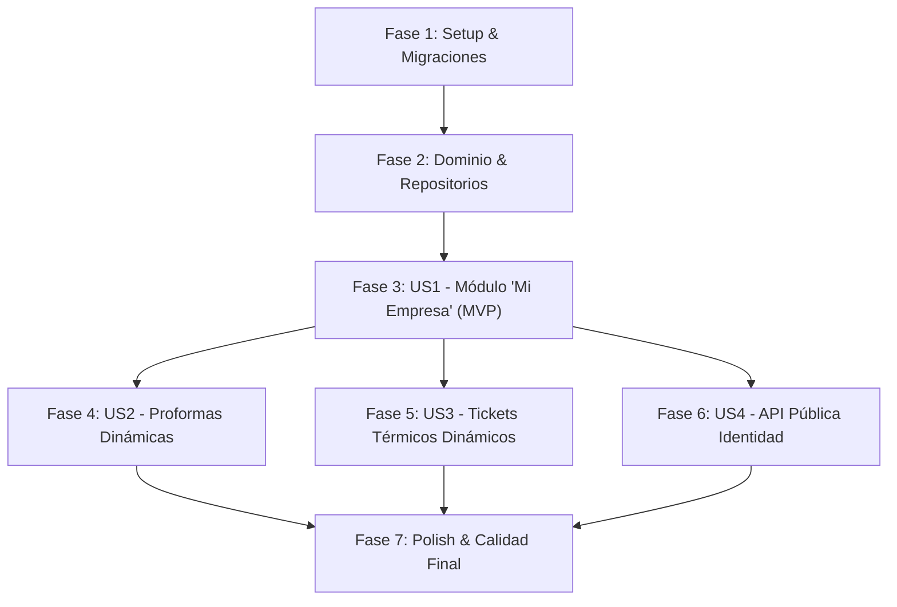

# Tasks: Configuración Centralizada de Mi Empresa, Sucursal y Comprobantes Dinámicos

**Input**: Documentos de diseño desde `/specs/007-datos-empresa-sucursal/`  
**Prerequisites**: [plan.md](plan.md), [spec.md](spec.md), [research.md](research.md), [data-model.md](data-model.md), [contracts/company-settings.yaml](contracts/company-settings.yaml)

---

## Phase 1: Setup & Migraciones de Base de Datos

**Purpose**: Inicialización del esquema de persistencia para la configuración singleton de la empresa.

- [x] T001 Crear migración `database/migrations/2026_10_03_000015_create_company_settings_table.php` con columnas `trade_name`, `legal_name`, `tax_id`, `slogan`, `branch_name`, `city`, `address`, `mobile`, `phone`, `email`, `logo_path`, `default_quote_terms` y `receipt_footer_message`.
- [x] T002 Ejecutar migración con `php artisan migrate`.
- [x] T003 Crear seeder `database/seeders/CompanySettingSeeder.php` con datos institucionales iniciales de fallback y registrarlo en `database/seeders/DatabaseSeeder.php`.

---

## Phase 2: Dominio & Repositorios (Hexagonal Foundations)

**Purpose**: Infraestructura central de dominio y acceso a datos que sustenta las historias de usuario.

- [x] T004 [P] Crear entidad de dominio `app/Domain/Company/CompanySetting.php` con todos los atributos inmutables y getter de `logoUrl`.
- [x] T005 [P] Crear contrato de repositorio `app/Domain/Company/CompanySettingRepositoryInterface.php` con métodos `get(): CompanySetting` y `save(array $data): CompanySetting`.
- [x] T006 Crear modelo Eloquent `app/Infrastructure/Persistence/Eloquent/CompanySettingModel.php` apuntando a la tabla `company_settings`.
- [x] T007 Implementar repositorio `app/Infrastructure/Persistence/Eloquent/EloquentCompanySettingRepository.php` asegurando fallback a valores predeterminados seguros en `get()`.
- [x] T008 Vincular `CompanySettingRepositoryInterface` con `EloquentCompanySettingRepository` en `app/Providers/AppServiceProvider.php`.

---

## Phase 3: User Story 1 - Parametrización y Administración de "Mi Empresa" (Priority: P1) 🎯 MVP

**Goal**: El Dueño puede configurar libremente desde el panel web la identidad, sucursal, ciudad, teléfonos, logo y políticas de su tienda, con persistencia y validaciones.

**Independent Test**: Modificar la ciudad a "Riberalta, Beni — Bolivia" y el teléfono en Ajustes > Mi Empresa; verificar persistencia inmediata en la base de datos y respuesta JSON de la API.

### Tests para User Story 1
- [x] T009 [P] [US1] Escribir prueba de Feature `tests/Feature/Company/CompanySettingManagementTest.php` verificando consulta, actualización multipart con subida de imagen, validaciones y restricción 403 para usuarios con rol vendedor.

### Implementación Backend y Frontend para User Story 1
- [x] T010 [P] [US1] Implementar caso de uso `app/Application/Company/GetCompanySettingUseCase.php`.
- [x] T011 [US1] Implementar caso de uso `app/Application/Company/UpdateCompanySettingUseCase.php` procesando el upload del logotipo al disco `public` (`storage/app/public/company`).
- [x] T012 [P] [US1] Crear request validator `app/Infrastructure/Http/Requests/UpdateCompanySettingRequest.php` con reglas de validación en español.
- [x] T013 [US1] Crear controlador `app/Infrastructure/Http/Controllers/Api/CompanySettingController.php` con métodos `show()` y `update()`.
- [x] T014 [US1] Registrar rutas protegidas en `routes/api.php` bajo middleware `jwt.auth` y grupo `owner` (`GET /api/company-settings` y `POST /api/company-settings`).
- [x] T015 [US1] Construir la página frontend `admin-starter-kit/src/pages/settings/company.vue` con pestañas ("Identidad Comercial", "Ubicación y Sucursal", "Contacto y Logotipo", "Políticas"), subida/previsualización de imagen y notificación Snackbar.
- [x] T016 [US1] Registrar ítem en menú `admin-starter-kit/src/navigation/vertical/index.js` bajo "Ajustes > Mi Empresa" protegido con CASL (`action: 'manage', subject: 'all'`).

**Checkpoint**: Módulo "Mi Empresa" 100% operativo en frontend y backend para el Dueño.

---

## Phase 4: User Story 2 - Inyección Dinámica en Proformas de Cotización (Priority: P2)

**Goal**: La proforma formal Carta consume directamente los datos institucionales de la base de datos, erradicando cualquier texto fijo ("Trinidad", teléfonos o términos quemados).

**Independent Test**: Cambiar la ciudad en Mi Empresa a "Riberalta, Beni" y el celular a "77112233"; al abrir `quotes/{id}/print` el membrete y términos muestran automáticamente los nuevos valores.

### Tests para User Story 2
- [x] T017 [P] [US2] Escribir prueba de Feature `tests/Feature/Quote/QuoteDynamicCompanyPrintTest.php` verificando que la vista de impresión refleja la ciudad, teléfonos, logo y términos configurados en `company_settings`.

### Implementación para User Story 2
- [x] T018 [US2] Actualizar método `printQuote` en `app/Infrastructure/Http/Controllers/Api/QuoteController.php` inyectando la entidad `$company` obtenida de `CompanySettingRepositoryInterface`.
- [x] T019 [US2] Refactorizar la plantilla [resources/views/quotes/print.blade.php](file:///Applications/XAMPP/xamppfiles/htdocs/servimatica-app/resources/views/quotes/print.blade.php) para reemplazar datos estáticos por `$company->tradeName`, `$company->slogan`, `$company->city`, `$company->address`, `$company->mobile`, `$company->logoUrl` y `$company->defaultQuoteTerms`.

**Checkpoint**: Proformas 100% dinámicas y personalizadas por la sucursal activa.

---

## Phase 5: User Story 3 - Inyección Dinámica en Tickets Térmicos (80mm) y Caja Chica (Priority: P3)

**Goal**: Tickets de venta POS (80mm), notas de recepción de compras y comprobantes de arqueo de caja chica renderizan automáticamente el membrete y políticas de la empresa.

**Independent Test**: Imprimir un ticket térmico de venta en mostrador y comprobar que el encabezado y pie de página muestran la sucursal, ciudad y mensaje de garantía vigentes.

### Tests para User Story 3
- [x] T020 [P] [US3] Escribir prueba de Feature `tests/Feature/Sale/SaleReceiptCompanyTest.php` comprobando que el ticket térmico de 80mm incluye la sucursal, NIT, teléfonos y política de garantía dinámicos.

### Implementación para User Story 3
- [x] T021 [US3] Actualizar método `receipt` en `app/Infrastructure/Http/Controllers/Api/SaleController.php` inyectando `$company`.
- [x] T022 [US3] Actualizar método `receipt` en `app/Infrastructure/Http/Controllers/Api/PurchaseController.php` inyectando `$company`.
- [x] T023 [US3] Actualizar método `receipt` en `app/Infrastructure/Http/Controllers/Api/CashShiftController.php` inyectando `$company`.
- [x] T024 [US3] Refactorizar [resources/views/sales/receipt.blade.php](file:///Applications/XAMPP/xamppfiles/htdocs/servimatica-app/resources/views/sales/receipt.blade.php), [resources/views/purchases/receipt.blade.php](file:///Applications/XAMPP/xamppfiles/htdocs/servimatica-app/resources/views/purchases/receipt.blade.php) y [resources/views/cash_shifts/receipt.blade.php](file:///Applications/XAMPP/xamppfiles/htdocs/servimatica-app/resources/views/cash_shifts/receipt.blade.php) con las variables de `$company`.

**Checkpoint**: Todos los comprobantes térmicos e impresos del sistema completamente sincronizados con "Mi Empresa".

---

## Phase 6: User Story 4 - Consulta Pública de Identidad Corporativa (Priority: P4)

**Goal**: Exponer un endpoint público y ligero de datos de marca para el frontend y futuras integraciones móviles sin exigir credenciales de administrador.

**Independent Test**: Ejecutar GET en `/api/company-settings/public` y recibir nombre comercial, ciudad, teléfono y URL de logo con status 200 sin token.

- [x] T025 [P] [US4] Implementar caso de uso `app/Application/Company/GetPublicCompanyInfoUseCase.php`.
- [x] T026 [US4] Agregar método `publicInfo()` en `CompanySettingController.php`.
- [x] T027 [US4] Registrar ruta pública `GET /api/company-settings/public` en `routes/api.php` fuera de middleware de autenticación.

---

## Phase 7: Polish, Cross-Cutting & Calidad Final

**Purpose**: Verificación de extremo a extremo, compilación de assets y ejecución de la suite de pruebas.

- [x] T028 Ejecutar suite de pruebas completa con `php artisan test`.
- [x] T029 Ejecutar compilación de producción del frontend con `pnpm run build` verificando cero advertencias.
- [x] T030 Ejecutar verificación visual paso a paso guiada por [quickstart.md](quickstart.md).

---

## Dependencias y Orden de Ejecución

### Oportunidades de Trabajo en Paralelo
- Las tareas marcadas con `[P]` (como interfaces, Value Objects, casos de uso desacoplados y tests TDD) no colisionan entre sí y pueden implementarse concurrentemente.
- La Fase 4 (Proformas) y Fase 5 (Tickets térmicos) pueden ejecutarse en paralelo una vez completada la Fase 3.
