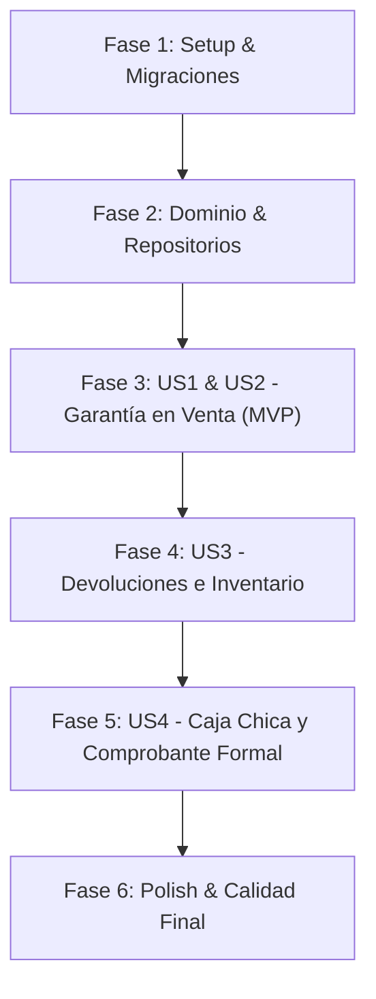

# Tasks: 008-devoluciones-garantias-ventas

**Input**: Documentos de diseño desde `/specs/008-devoluciones-garantias-ventas/`  
**Prerequisites**: [plan.md](plan.md), [spec.md](spec.md), [research.md](research.md), [data-model.md](data-model.md), [contracts/sale-returns.yaml](contracts/sale-returns.yaml)

---

## Phase 1: Setup & Migraciones de Base de Datos

**Purpose**: Creación y extensión de esquemas para garantías técnicas, números de serie y devoluciones.

- [x] T001 Crear migración `database/migrations/2026_10_03_000016_add_warranty_and_defective_to_products_and_sales.php` agregando `warranty_days` y `defective_stock` a `products`, `warranty_days`, `warranty_expires_at` y `serial_number` a `sale_items`, y `total_cash_refunds` a `cash_shifts`.
- [x] T002 Crear migración `database/migrations/2026_10_03_000017_create_sale_returns_and_items_tables.php` creando las tablas `sale_returns` y `sale_return_items` con sus claves foráneas, índices y enums.
- [x] T003 Ejecutar migraciones con `php artisan migrate`.

---

## Phase 2: Dominio & Repositorios (Hexagonal Foundations)

**Purpose**: Estructura de dominio inmutable, contratos y persistencia para el módulo de devoluciones y garantías.

- [x] T004 [P] Actualizar entidad `app/Domain/Sale/SaleItem.php` incorporando `warrantyDays`, `warrantyExpiresAt` y `serialNumber` con sus respectivos métodos y getters.
- [x] T005 [P] Crear entidades de dominio `app/Domain/Sale/SaleReturn.php` y `app/Domain/Sale/SaleReturnItem.php` con atributos inmutables y reglas de negocio.
- [x] T006 [P] Crear contrato de repositorio `app/Domain/Sale/SaleReturnRepositoryInterface.php` con métodos de persistencia, consulta por id y listado paginado.
- [x] T007 Crear modelos Eloquent `app/Infrastructure/Persistence/Eloquent/SaleReturnModel.php` y `app/Infrastructure/Persistence/Eloquent/SaleReturnItemModel.php` con sus relaciones y castings.
- [x] T008 Implementar repositorio `app/Infrastructure/Persistence/Eloquent/EloquentSaleReturnRepository.php` y vincularlo en `app/Providers/AppServiceProvider.php`.

---

## Phase 3: User Story 1 & 2 - Garantía en Ventas y Verificación en Mostrador (Priority: P1/P2) 🎯 MVP

**Goal**: Asignar y registrar el periodo de garantía en cada venta (con serial opcional), imprimirlo en los comprobantes y habilitar la consulta rápida de vigencia en mostrador.

**Independent Test**: Realizar una venta en el POS con garantía de 180 días y serial `S/N: 98765`; consultar el endpoint `/api/sales/{id}/warranty-check` y verificar que retorna `is_warranty_valid: true`, `days_remaining: 180` y el serial correspondiente.

### Tests para User Story 1 & 2
- [x] T009 [P] [US1] Escribir prueba de Feature `tests/Feature/Sale/SaleWarrantyTrackingTest.php` verificando la persistencia de garantía y serial en ventas, el cálculo automático de `warranty_expires_at` y la respuesta del verificador de garantías.

### Implementación Backend y Frontend para User Story 1 & 2
- [x] T010 [US1] Actualizar `app/Application/Sale/CreateSaleUseCase.php` para recibir `warranty_days` y `serial_number` por ítem, calculando `warranty_expires_at = now()->addDays($warrantyDays)`.
- [x] T011 [US1] Actualizar `app/Infrastructure/Http/Requests/CreateSaleRequest.php` para aceptar y validar `items.*.warranty_days` y `items.*.serial_number`.
- [x] T012 [P] [US2] Implementar caso de uso `app/Application/Sale/CheckSaleWarrantyUseCase.php` calculando vigencia y saldo disponible para devolución.
- [x] T013 [US1] Actualizar la plantilla Blade `resources/views/sales/receipt.blade.php` para imprimir el tiempo de garantía, fecha de vencimiento y serial debajo de cada producto vendido.
- [x] T014 [US1] Actualizar el carrito del POS en `admin-starter-kit/src/views/pos/PosCart.vue` permitiendo seleccionar el tiempo de garantía (30, 90, 180, 365 días) e ingresar el número de serie opcional por ítem.
- [x] T015 [US2] Crear método `warrantyCheck()` en `app/Infrastructure/Http/Controllers/Api/SaleReturnController.php` y registrar ruta `GET /api/sales/{id}/warranty-check` en `routes/api.php`.
- [x] T016 [US2] Agregar columna o botón "Verificar Garantía" en el listado de ventas `admin-starter-kit/src/pages/sales/index.vue`.

**Checkpoint**: Ventas con garantía y verificación en mostrador 100% funcionales e integradas.

---

## Phase 4: User Story 3 - Procesamiento de Devolución y Segregación de Inventario (Priority: P3)

**Goal**: Registrar la devolución formal de artículos vendidos con destino a stock vendible o stock defectuoso/cuarentena sin contaminar el inventario operativo.

**Independent Test**: Devolver una memoria RAM fallada con condición `stock_defectuoso_rma`; verificar que `products.stock` vendible no aumenta pero se incrementa `products.defective_stock`.

### Tests para User Story 3
- [x] T017 [P] [US3] Escribir prueba de Feature `tests/Feature/Sale/SaleReturnProcessingTest.php` verificando devolución total y parcial, validación de cantidad máxima, y segregación entre stock operativo y defectuoso.

### Implementación para User Story 3
- [x] T018 [US3] Implementar caso de uso `app/Application/Sale/ProcessSaleReturnUseCase.php` ejecutando la transacción atómica de actualización de inventario (`stock` vs `defective_stock`) y creación de `SaleReturn`.
- [x] T019 [P] [US3] Crear request validator `app/Infrastructure/Http/Requests/CreateSaleReturnRequest.php` validando resolución, motivo y detalle de ítems según contrato OpenAPI.
- [x] T020 [US3] Agregar método `store()` en `app/Infrastructure/Http/Controllers/Api/SaleReturnController.php` y registrar ruta protegida `POST /api/sales/{id}/returns` en `routes/api.php`.
- [x] T021 [US3] Construir el modal `admin-starter-kit/src/views/sales/SaleReturnDialog.vue` que permite seleccionar los ítems a devolver, cantidad, motivo y condición del producto.
- [x] T022 [US3] Conectar `SaleReturnDialog.vue` en `admin-starter-kit/src/pages/sales/index.vue` disparado desde el botón de acción de cada venta.
- [x] T023 [US3] Agregar contador o visualizador de stock defectuoso en la vista de inventario `admin-starter-kit/src/pages/products/index.vue`.

**Checkpoint**: Devolución de productos y protección de inventario defectuoso 100% operativos.

---

## Phase 5: User Story 4 - Resoluciones Comerciales, Arqueo de Caja y Comprobante Formal (Priority: P4)

**Goal**: Permitir liquidar la devolución mediante cambio físico 1 a 1, reembolso de efectivo con egreso en caja chica o nota de crédito, generando la nota de cambio formal impresa.

**Independent Test**: Procesar una devolución con reembolso de Bs. 120 en efectivo; verificar que el turno de caja chica actual registra el egreso de Bs. 120 en `total_cash_refunds` y genera el ticket impreso de devolución.

### Tests para User Story 4
- [x] T024 [P] [US4] Escribir prueba de Feature `tests/Feature/Sale/SaleReturnFinancialTest.php` comprobando decremento de stock en cambio físico 1 a 1, registro de egreso en caja en reembolso en efectivo y restricción 403 para vendedores en reembolsos sin permiso.

### Implementación para User Story 4
- [x] T025 [US4] Actualizar `ProcessSaleReturnUseCase.php` para descontar 1 unidad en `cambio_fisico` y registrar el egreso en `cash_shifts` si la resolución es `reembolso_efectivo`.
- [x] T026 [US4] Crear plantilla Blade `resources/views/sales/return_receipt.blade.php` con formato térmico (80mm) y Carta formal, inyectando datos institucionales dinámicos de `$company`.
- [x] T027 [US4] Implementar método `receipt()` en `SaleReturnController.php` y registrar ruta pública `GET /api/sale-returns/{id}/receipt` en `routes/api.php`.
- [x] T028 [US4] Crear página de historial de devoluciones `admin-starter-kit/src/pages/sales/returns.vue` con filtros por fecha y tipo de resolución.
- [x] T029 [US4] Registrar ítem "Devoluciones" en el submenú de Ventas en `admin-starter-kit/src/navigation/vertical/index.js` y router.

**Checkpoint**: Circuito financiero, control de caja y comprobantes de devolución completamente cerrados.

---

## Phase 6: Polish, Cross-Cutting & Calidad Final

**Purpose**: Verificación integral de extremo a extremo, suite de pruebas y compilación de producción.

- [x] T030 Ejecutar suite completa de pruebas con `php artisan test`.
- [x] T031 Ejecutar compilación de producción del frontend con `pnpm run build` en `admin-starter-kit/`.
- [x] T032 Ejecutar verificación visual paso a paso guiada por [quickstart.md](quickstart.md).

---

## Dependencias y Orden de Ejecución

### Oportunidades de Trabajo en Paralelo [P]
- T004, T005 y T006 (entidades de dominio e interfaz) no tienen dependencias cruzadas y pueden crearse simultáneamente.
- Los tests T009, T017 y T024 se escriben previo a su respectiva implementación de servicios (TDD estricto).
