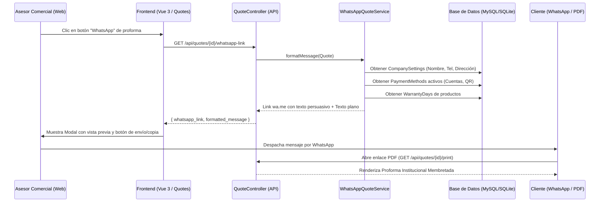

# Implementation Plan: Capítulo 13 — Rediseño Integral de Proformas y Cotizaciones (WhatsApp Comercial Persuasivo + PDF Institucional)

**Branch**: `013-redisenio-proformas-cotizaciones`  
**Spec Reference**: `specs/013-redisenio-proformas-cotizaciones/spec.md`  
**Created**: 2026-10-04  

---

## 1. Technical Context

- **Backend:** PHP 8.x / Laravel 12.
- **Capa de Aplicación:** `App\Application\Quote\WhatsAppQuoteService` refactorizado para enriquecer el mensaje con persuasión comercial y fuentes dinámicas de datos.
- **Persistencia & Modelos:**
  - `CompanySettingModel` (`company_settings`): trade_name, slogan, city, address, mobile, phone, email, logo_path, warranty_terms.
  - `PaymentMethodModel` (`payment_methods`): name, type, bank_name, account_number, account_holder, is_active.
  - `ProductModel` (`products`): warranty_days.
  - `QuoteModel` & `QuoteItemModel` (`quotes`, `quote_items`).
- **Vista de Impresión:** `resources/views/quotes/print.blade.php` con logotipo oficial de Servimática, diseño CSS para impresión a 1 página Carta/A4, detalles de garantía y bloque bancario/QR.
- **Frontend Web:** Vue 3 / Vuetify 3 en `admin-starter-kit/src/pages/quotes/index.vue`.
- **Restricción Estricta:** PROHIBIDO `php artisan serve`.

---

## 2. Constitution Check

- [x] **Principle I: Hexagonal Architecture & Clean DDD:** El formateo de cotizaciones reside en la capa de Aplicación (`WhatsAppQuoteService`), consumiendo repositorios/modelos de infraestructura.
- [x] **Principle II: Zero Serve:** Se utiliza el entorno local `http://servimatica-app.test`.
- [x] **Principle III: UI & Materio Conventions:** Se reutilizan estilos y componentes de Vuetify (`VDialog`, `VCard`, `VBtn`, `VTextField`, `VSnackbar`).
- [x] **Principle IV: No Exotic Dependencies:** Se utiliza codificación nativa `rawurlencode` y Blade estándar con CSS puro de impresión, sin librerías pesadas externas.

---

## 3. Architecture & Data Flow

---

## 4. Phase Breakdown

### Phase 0: Research & UTF-8 Encoding
- Garantizar que los caracteres especiales (`•`, `✅`, `🛡️`, `💵`, `💳`, `📍`, `👉`, acentos en español) no se degraden en ningún navegador o versión de WhatsApp móvil / web usando codificación UTF-8 limpia y `rawurlencode`.
- Resolver la conversión amigable de días a meses para la garantía (ej: `365` días -> `12 meses`, `180` días -> `6 meses`, `90` días -> `3 meses`, o `X días` si no es múltiplo de 30).

### Phase 1: Design Artifacts
- Generar `research.md`, `data-model.md`, `contracts/quote-whatsapp.yaml` y `quickstart.md`.

### Phase 2: Implementation & Tests
- Actualizar `WhatsAppQuoteService` para recibir/consultar datos de empresa, medios de pago y garantías.
- Actualizar controlador de cotizaciones para retornar tanto el enlace directo como el texto formateado.
- Rediseñar `resources/views/quotes/print.blade.php`.
- Actualizar `admin-starter-kit/src/pages/quotes/index.vue` con el modal interactivo de previsualización y copia rápida.
- Ejecutar y actualizar pruebas automatizadas `tests/Feature/Quote/QuoteDynamicCompanyPrintTest.php` y `tests/Feature/Quote/QuoteManagementTest.php`.
