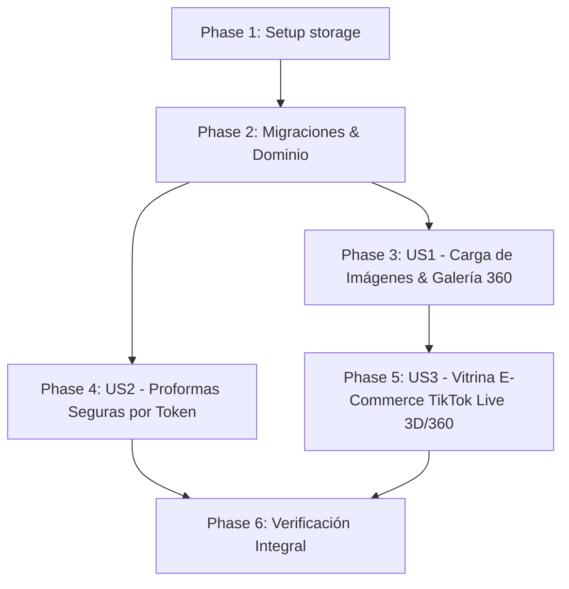

# Tasks: Galería de Imágenes, Vitrina 360°/3D para TikTok Live y Enlace Seguro de Proformas

**Input**: Design artifacts from `specs/014-galeria-imagenes-vitrina-360-proformas-seguras/`  
**Prerequisites**: `spec.md`, `plan.md`, `data-model.md`, `contracts/`, `research.md`, `quickstart.md`

---

## Phase 1: Setup & Prerequisites

**Purpose**: Estructura de almacenamiento y carpetas públicas de activos multimedia

- [X] T001 Asegurar enlace simbólico de almacenamiento público con `php artisan storage:link` y directorio `storage/app/public/products/`
- [X] T002 [P] Copiar placeholders e iconos vectoriales por categoría (laptop, pc, monitor, accesorio) en `public/images/placeholders/`

---

## Phase 2: Foundational (Database Migrations & Core Domain)

**Purpose**: Migraciones del esquema relacional y entidades base que bloquean todas las historias de usuario

- [X] T003 Crear migración `database/migrations/2026_10_04_000002_add_images_to_products_table.php` agregando `image_path` (VARCHAR 255 nullable) y `gallery_images` (JSON nullable) a `products`
- [X] T004 Crear migración `database/migrations/2026_10_04_000003_add_public_token_to_quotes_table.php` agregando `public_token` (CHAR 36 UNIQUE) a `quotes` y poblando UUIDs para registros existentes
- [X] T005 [P] Actualizar la entidad `app/Domain/Product/Product.php` y el modelo Eloquent `app/Infrastructure/Persistence/Eloquent/ProductModel.php` con `$imagePath`, `$galleryImages`, `$imageUrl` y `$galleryUrls`
- [X] T006 [P] Actualizar la entidad `app/Domain/Quote/Quote.php` y el modelo Eloquent `app/Infrastructure/Persistence/Eloquent/QuoteModel.php` con `$publicToken` y generación automática de UUID en creación

---

## Phase 3: User Story 1 - Gestión de Imagen Principal y Galería 360° en Catálogo (Priority: P1) 🎯 MVP

**Goal**: Permitir al administrador cargar foto de portada y entre 2 y 8 fotos en secuencia 360° al crear o editar productos desde el panel, con previsualización inmediata y eliminación.

**Independent Test**: Editar un producto desde `AddProductDrawer.vue`, adjuntar imagen de portada y 4 fotos de galería, guardar y verificar que se almacenen en disco y se rendericen en la tabla y en el drawer.

- [X] T007 [P] [US1] Crear pruebas de integración en `tests/Feature/Product/ProductImageManagementTest.php` validando la subida multipart de portada y galería JSON con validación de tipo MIME y tamaño
- [X] T008 [US1] Implementar servicio de aplicación `app/Application/Product/UploadProductImagesService.php` para validar, redimensionar/optimizar a formato webp y almacenar en `storage/app/public/products/`
- [X] T009 [US1] Actualizar `app/Infrastructure/Http/Controllers/Api/ProductController.php` (métodos `store` y `update`) para recibir `multipart/form-data` con `image` (portada) y `gallery[]` (fotos de ángulos)
- [X] T010 [US1] Actualizar `admin-starter-kit/src/views/products/AddProductDrawer.vue` incorporando la zona de dropzone/file input para la imagen de portada y la sección "Galería Multi-Ángulo 360°" con preview y eliminación reactiva
- [X] T011 [US1] Actualizar la tabla de productos en `admin-starter-kit/src/pages/products/index.vue` para mostrar el avatar/thumbnail de la foto real del producto o su placeholder estilizado por categoría

---

## Phase 4: User Story 2 - Enlaces Públicos Seguros / Tokenizados de Proforma PDF (Priority: P2)

**Goal**: Permitir que los clientes abran su proforma mediante un token criptográfico no secuencial (`/quotes/public/{public_token}`), bloqueando la enumeración por ID y ofreciendo una vista ejecutiva adaptada a celulares con botón de descarga PDF.

**Independent Test**: Consultar el endpoint de WhatsApp link, verificar que el link use el UUID `public_token`, abrirlo en ventana de incógnito sin token JWT y comprobar que renderiza la cotización, mientras que el acceso anónimo por ID `/quotes/1/print` es rechazado.

- [X] T012 [P] [US2] Crear pruebas de integración en `tests/Feature/Quote/QuotePublicTokenSecurityTest.php` validando el acceso público vía token UUID y la denegación de acceso anónimo a IDs secuenciales
- [X] T013 [US2] Crear caso de uso `app/Application/Quote/GetQuoteByPublicTokenUseCase.php` para resolver cotizaciones de forma pública e inyectar datos de empresa y formas de pago
- [X] T014 [US2] Implementar `app/Infrastructure/Http/Controllers/Api/PublicQuoteController.php` con la ruta pública `GET /api/quotes/public/{public_token}` y vista móvil responsiva con botón destacado "📥 Descargar PDF"
- [X] T015 [US2] Actualizar `app/Application/Quote/WhatsAppQuoteService.php` y `routes/api.php` para que todos los enlaces generados utilicen el `public_token` en lugar del ID correlativo

---

## Phase 5: User Story 3 - Vitrina Pública E-Commerce para TikTok Live con Efecto 3D Tilt y Giro 360° (Priority: P3)

**Goal**: Publicar la vitrina interactiva `/catalogo` abierta para espectadores de TikTok Live con tarjetas 3D Parallax/Tilt, visor táctil 360° turntable por secuencia de fotos y botón directo para pedir por WhatsApp.

**Independent Test**: Abrir `/catalogo` en el navegador móvil sin login, constatar que las tarjetas tienen efecto 3D al deslizar, abrir la ficha de una laptop para girarla 360° con el pulgar y tocar "Pedir por WhatsApp" verificando que abra el chat con el mensaje prearmado.

- [X] T016 [P] [US3] Crear pruebas funcionales en `tests/Feature/Catalog/PublicCatalogApiTest.php` validando el endpoint público `GET /api/public/catalog` (filtros, stock positivo, exclusión estricta de costos y proveedores)
- [X] T017 [US3] Implementar `app/Application/PublicCatalog/ListPublicCatalogUseCase.php` y el controlador `app/Infrastructure/Http/Controllers/Api/PublicCatalogController.php` retornando `PublicProductDTO`

- [X] T018 [US3] Crear el componente reutilizable `admin-starter-kit/src/views/catalog/ProductCard3D.vue` con efecto Parallax Tilt táctil, badges de garantía y botón de pedido WhatsApp
- [X] T019 [US3] Crear el componente modal `admin-starter-kit/src/views/catalog/Product360Modal.vue` con visor táctil turntable (swipe horizontal fluido) utilizando las imágenes de la galería
- [X] T020 [US3] Crear la página pública `admin-starter-kit/src/pages/catalog/index.vue` (y configurar bypass en `router` y CASL para acceso anónimo sin redirigir a `/login`) con buscador y filtros rápidos por categoría/marca

---

## Phase 6: Polish & Cross-Cutting Concerns

**Purpose**: Verificación integral, pruebas automatizadas, optimización de bundles y compilación

- [X] T021 Ejecutar suite de pruebas de productos, proformas y catálogo con `php artisan test`
- [X] T022 Compilar frontend de producción con `pnpm --prefix admin-starter-kit run build` verificando cero errores
- [X] T023 Validar escenarios de `quickstart.md` en navegador móvil y de escritorio

---

## Dependencies & Execution Order

### Oportunidades de Ejecución en Paralelo
- **T003 y T004**: Migraciones creadas simultáneamente.
- **T005 y T006**: Entidades de Dominio (`Product` y `Quote`) actualizadas en paralelo.
- **T007, T012 y T016**: Suites de pruebas de cada historia de usuario escritas en paralelo.
- **T018 y T019**: Componentes de Vue (`ProductCard3D.vue` y `Product360Modal.vue`) desarrollados en paralelo.

### Alcance MVP Recomendado
El **MVP (Fase 1 + Fase 2 + Fase 3)** permite cargar inmediatamente las fotos reales y galería multi-ángulo de los equipos en el panel administrativo, asegurando la materia prima visual antes de desplegar la vitrina a los espectadores de TikTok Live.
